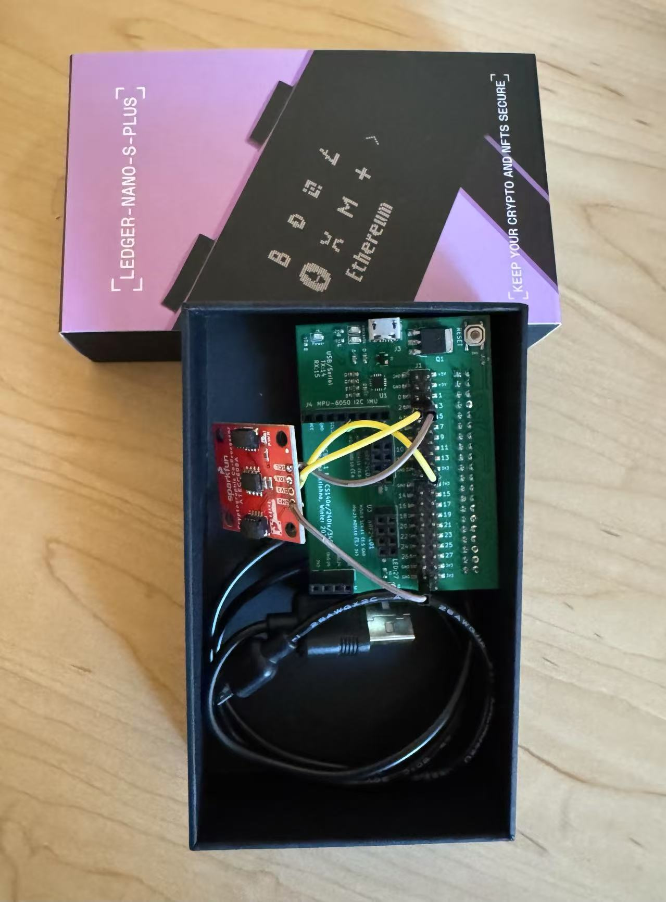

# RaspberryTEE
Bare-metal implementation on Raspberry Pi (BCM2835) with ATECC608A trusted hardware chip to sign blockchain transactions securely

Jay Yu and Rishi Padmanabhan

[Stanford CS 140E: Embedded Operating Systems](https://github.com/dddrrreee/cs140e-25win), Winter 2025 Final Project

## About

How can you build a baremetal Trusted Execution Environment (TEE) with $5 hardware? This project is a simple implementation of a TEE-like environment on a Raspberry Pi using a trusted hardware chip, similar to hardware wallets like Ledger or Trezor.

We used the ATECC608A secure element, a widely available trusted hardware chip to do keygen, sign, and verify transactions for a baremetal Raspberry Pi (BCM2835). We bought [ATECC608A breakout boards from Sparkfun](https://www.sparkfun.com/sparkfun-cryptographic-co-processor-breakout-atecc608a-qwiic.html), soldered it to a BCM2835 hardware device used for CS140E, and implemented a simple I2C protocol and wrote baremetal drivers for the trusted hardware chip. The ATECC608A chip cost about $5 each, whereas a typical hardware wallet can cost $100 or more.

Unfortunately, the ATECC608A secure chip only has documentation for the NIST P256 elliptic curve, rather than the secp256k1 curve used by Bitcoin, Ethereum, and other cryptocurrencies, so for the purposes of this project, we only implemented support for P256. For secp256k1 support, we also included a supplemental Arduino ATECC608A I2C slave simulator that uses the `micro-ecc` library with `secp256k1` curve as a proof-of-concept.

Note that this project is intended as an academic prototype, and should not be used or deployed as a production TEE system.

## Key Features

- Baremetal implementation of I2C protocol (Raspberry Pi BCM2835 SoC as I2C master) in `i2c.c`
- Baremetal implementation of ATECC608A commands with default configuration in `atecc608a.c`
- Private key securely stored in ATECC608A, public key available upon request
- Sign arbitrary messages with ECDSA-P256 private key
- Verify signatures against the corresponding ECDSA-P256 public key
- Test suite in `proj/1-i2c/tests`
- Supplemental Arduino ATECC608A I2C slave simulator for testing I2C communication in `arduino-atecc608a` that uses `micro-ecc` library with `secp256k1` curve (aka Bitcoin curve)

## Setup

1. Assumes working `pi-install` bootloader tool from [CS140E repo](https://github.com/dddrrreee/cs140e-25win). Copy included in `proj/0-pi-setup/pi-install`. See baremetal implementation of CS 140E bootloader in `labs/6-bootloader`.
2. Please set `CS140E_2025_PATH_FINAL` to the path of this project repository. 
3. Make `libpi`, `cd libpi && make`
4. `cd proj/1-i2c` and `make run`

## Usage

- Run `make run` in each subdirectory to execute the test programs
- Run `make clean` to clean up the build directory

## Notes

- ATECC608A is configured to use I2C address 0x60
- We used the default configuration from Sparkfun ATECC608A breakout board, available [here](https://learn.sparkfun.com/tutorials/cryptographic-co-processor-atecc508a-qwiic-hookup-guide/).
- ATECC608A is configured to use slot 0 for private key
- Although it may be possible to reverse-engineer secp256k1 functionality from the ATECC608A, we did not attempt to do so in the scope of this project
- The ATECC608A has [many known vulnerabilities](https://hardwear.io/netherlands-2023/presentation/triple-exploit-chain-with-laser-fault-injection-on-a-secure-element.pdf), and should not be used in critical production systems. We used it in this project for an academic prototype for its simplicity and low cost.
